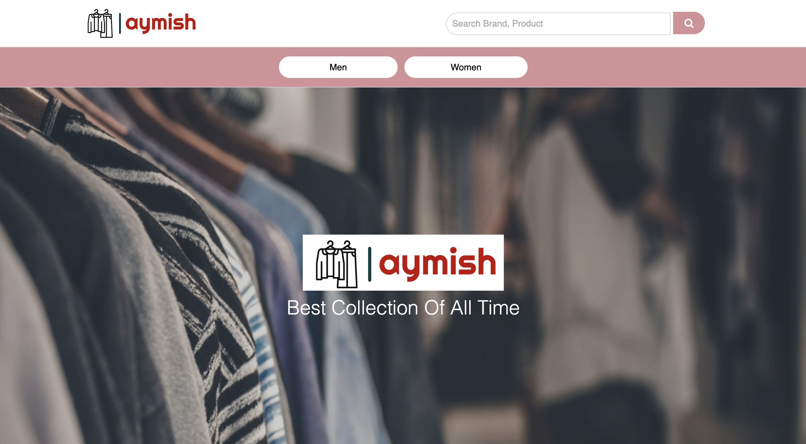
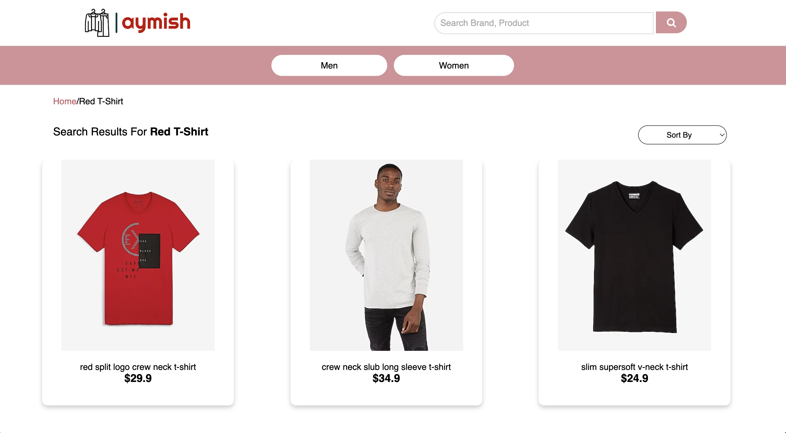

# aymish-apparels (Team-6)
Simple e-commerce website

# Summary
* The repository contains code used to build a simple e-commerce website **Aymish Apparels** 
* Users can:
    * search for products
    * shortlist products according to categories
    * view the above in sorted manner
* Vendors can:
    * insert products to the catalog using the ingestion API
* Technologies used:
    * **Frontend**: HTML, CSS, JS
    * **Backend**: Python flask
    * **Database**: PostgreSQL
    * **Cache**: Redis
    * **External API**: Unbxd Search API
    * **Containerization**: Docker
    
# API Specs:
* Retrieve level1 categories having subcategories
```
GET-
GET http://localhost:5000/cat-level-1 HTTP/1.1
Host: localhost
```
* Retrieve level2 categories belonging to level 1 category
```
GET-
GET http://localhost:5000/cat-level-2-with-parent-id?catlevel1Id=1 HTTP/1.1
Host: localhost
```

* Retrieve products using category drop-down list
```
GET-
GET http://localhost:5000/category-product-list?catlevel1Id=1&catlevel2Name=Suiting HTTP/1.1
Host: localhost
```

* Retrieve product details
```
GET-
GET http://localhost:5000/product?uniqueId=04351010 HTTP/1.1
Host: localhost
```

* Retrieve products using search bar
```
GET-
GET http://localhost:5000/search?q=shirt&rows=90&order=asc&page=1 HTTP/1.1
Host: localhost
```
* Data ingestion
```
POST-
POST http://localhost:5000/ingestion HTTP/1.1
Host: localhost
```

# Link to postman collection:
https://api.postman.com/collections/25326353-5ea394d3-73c9-46ce-97a4-20af33abcd58?access_key=PMAT-01GRTFDM662MCJRDJHTJJCDSJP

# API Documentation
https://documenter.getpostman.com/view/25326353/2s93CHuavF

# Config files:
* Database
```yaml
host: "xyz"
dbname: "postgres"
user: "xyz"
password: "xyz"
port: 5432
```
* Cache
```yaml
host: "localhost"
port: 6379
decode_responses: True
```
* Search
```yaml
unbxd_search_api: "https://search.unbxd.io/fb853e3332f2645fac9d71dc63e09ec1/demo-unbxd700181503576558/search"
rows_count: 90
```

# Running the services
* Frontend
    * run at port 8080 via nginx-server
* Backend
    * run at port 5000 via flask
    * Data ingestion  
        ```
        curl -X POST -H "Content-Type: application/json" -d @out.json http://127.0.0.1:5000/ingestion
        ```
        
# Screenshots
* Home page


* Pagination


* Search products list page


* Category products list page (normal)


* Category products list page (sorted)


* Product details page


* Product page with recommendations

